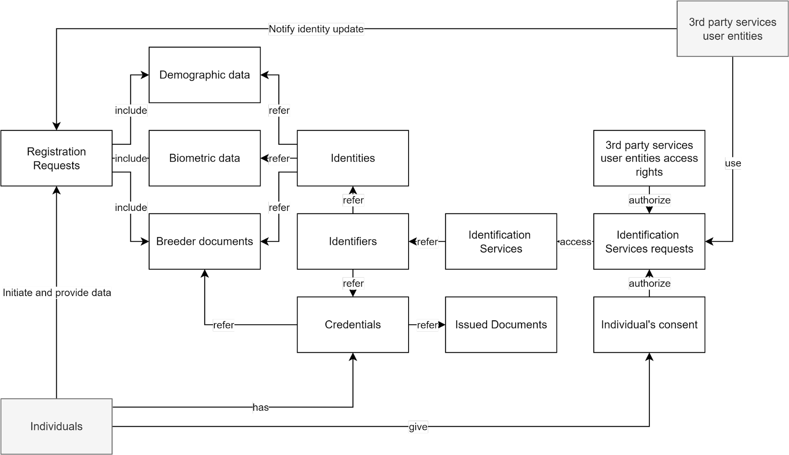

# 7 Data Structures

Identity and Verification Building Block requires data objects, below are the main ones involved listed:

* **Identities** of individuals identified by unique identifiers.
* **Identifiers**:
  * Token number associated uniquely with a set of data, identifiers are used to refer to those data without having to actually copy them.
  * They can be stored then in separate repositories with specific restricted access.
  * Identifiers can be used to uniquely identify Foundational IDs or Functional IDs.
  * Token identifiers can be used to avoid data aggregation and ensure capacity to forget an identity.
  * As identity data should be stored in different storage to ensure privacy protection allowing then data separation and data minimization principles, it’s necessary to use different identifiers for different types of data.
* **Credentials**:
  * Issued for individuals or presented by them, ID Credentials related to an individual should be traced and accessible in the system in order to have capacity to identify fraud and do investigation on them, so has performing auditing.
* **Registration requests**
  * Requests will be received by the Identity and Verification Building Block, for example, identity enrollment requests or identity data update registration requests, those requests will be then managed by the different subsystems and the workflows of Identity and Verification Building Block.
* **Identification Services**
  * A set of services will be offered on top of identities to identify a person, check some of his/her attributes (i.e. age), or obtain some certified personal information when needed and authorized.
* **3rd parties services user entities**
  * External entities which could be GovStack building blocks or not, will have access to and use the services, for that purpose their access will be granted, consent may be given by the individuals and their activities will be logged.

The schema below shows their interactions and brings more details on involved data objects

